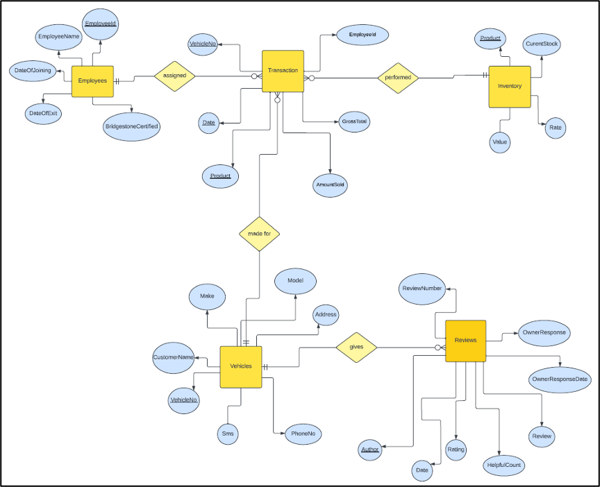
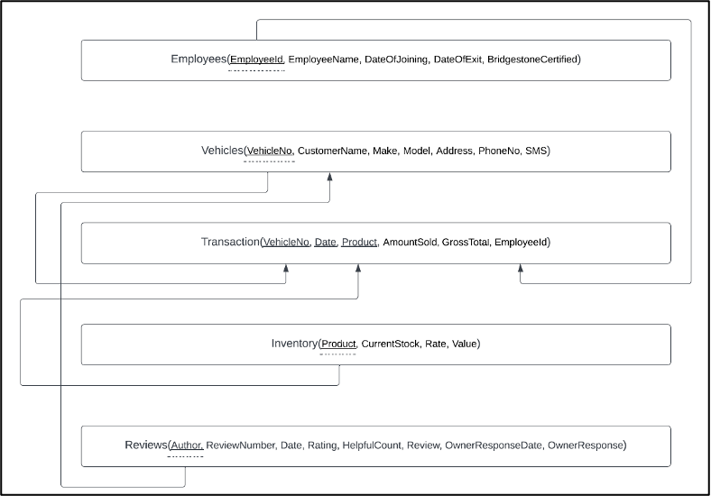
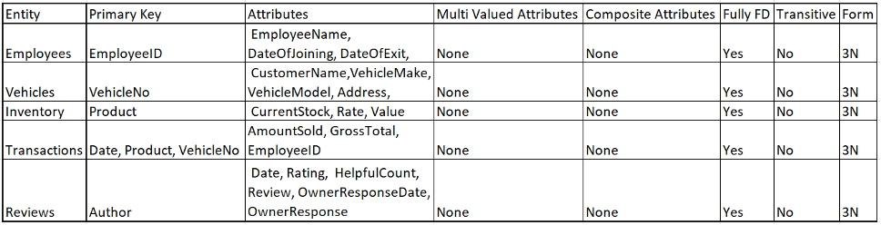

<h1>SQL Project to Create and Optimize the Database of a Tire Dealership </h1>

**Introduction**

The subject of this project is to improve the existing database of a client by normalizing the data, designing an entity relationship diagram & developing a relational schema for a clear understanding of the database and performing analysis to obtain tangible business insights.

**Client**

The client is a Bridgestone franchise outlet that primarily sells tyres, along with parts like alloy wheels and wheel balancing weights. Additionally, the outlet operates a servicing and alignment workshop. The outlet is located in Palakkad, India which is a town in the southern Indian state of Kerala. The business sells around 400-500 tyres on a monthly basis and maintains a loyal customer base with interests in premium products and the Bridgestone brand.

**Problem Statement**

The business has recently moved towards maintaining a larger database of their business activities, using data not only for standard business procedures like recording sales and inventory, but also in understanding employee performance and customer sentiment through google reviews. The challenge though is in increasing employee adoption and identifying low-hanging fruits in terms of analysis that can create impact in the business.

**Entity Relationship Diagram**

The data obtained consisted of 5 entities:

1. Transactions – A record of each sale
1. Inventory – The closing balance of inventory in hand at the outlet at the end of the analysis period (March 31, 2018)
1. Employees – A record of each employee’s basic details
1. Vehicles – A record of the vehicles which have been served at the outlet and the customers who own the vehicle
1. Reviews – Google reviews data

Based upon these entities and the attributes within them, an entity relationship diagram was designed to clearly understand the relationship between the entities.

**Relational Schema**

To model the database as suitable for MySQL, a relational schema is developed so that each entity can be uploaded with the appropriate primary and foreign keys required for querying.

**Normalization**

To eliminate redundancy and enhance data integrity, normalization is performed. With regards to the data obtained, 4 of the 5 tables – Employees, Vehicles, Reviews and Inventory were already normalized to the 3N form. The Transactions table existed in the 2N form with some transitive relationships. For example, the name and the phone number available in each record is determined by the vehicle number present in the record. To achieve the 3N form, the dependent columns are dropped to eliminate any transitive columns.

**Commentary on Data Model**

The 5 entities obtained consisted of 1 fact table – Transactions, and 4 dimension tables – Vehicles, Employees, Inventory and Reviews. The relationships that exist were all one to many relationships, primarily with the many side towards the Transactions table and the one side towards the dimension table being considered.

The data model was subject to a significant amount of missing values in multiple columns, which contributed towards defining primary keys. For example, the large number of missing values in the name field in the vehicles table led to the vehicle number being considered as the primary key, without being able to assign ownership of a transaction completely to a customer.

The analysis was tuned towards not only understanding business performance, but also making sense of the missing data and what can be done to improve data quality in the client’s database.
